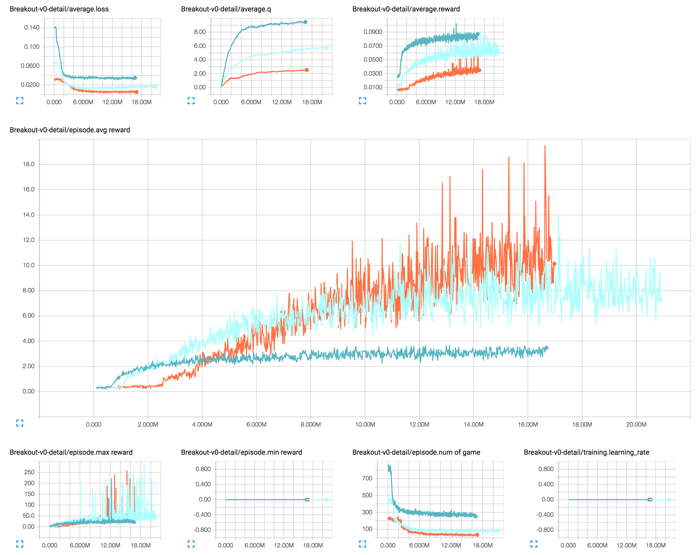
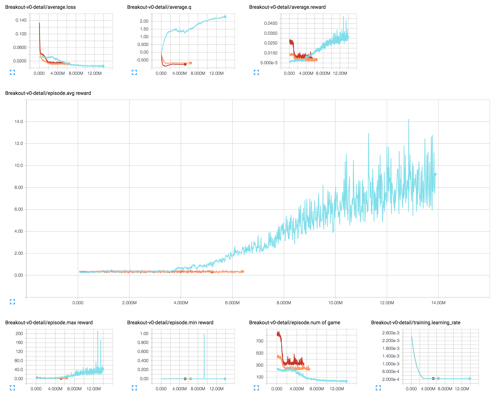
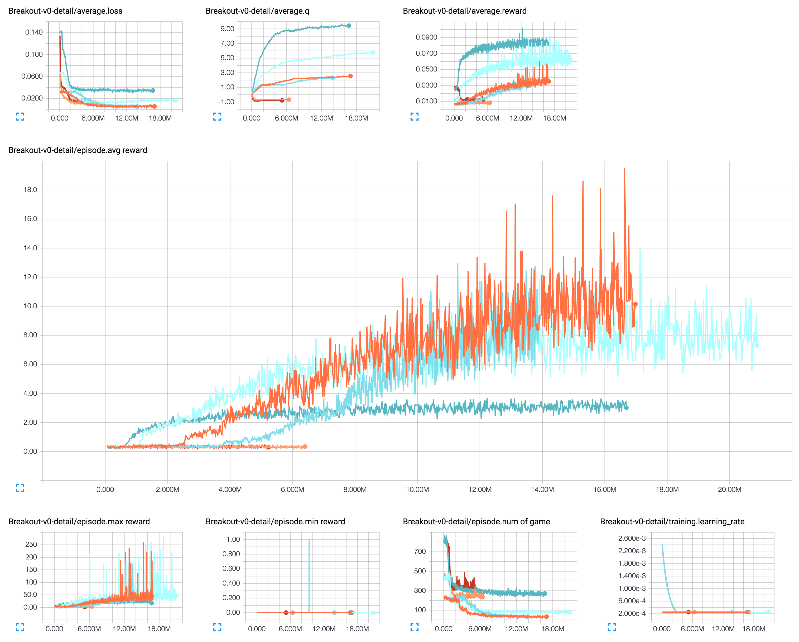
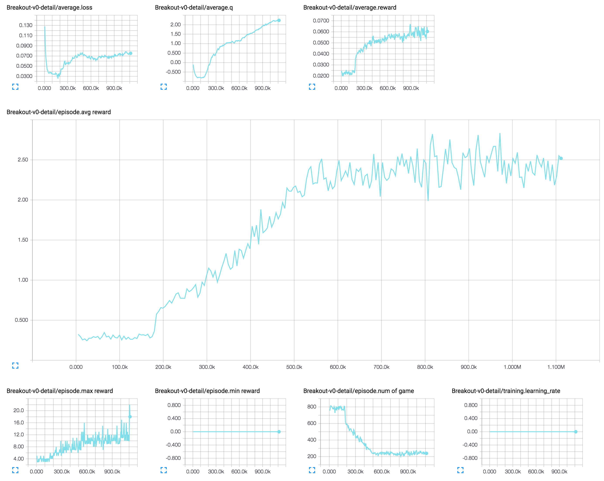
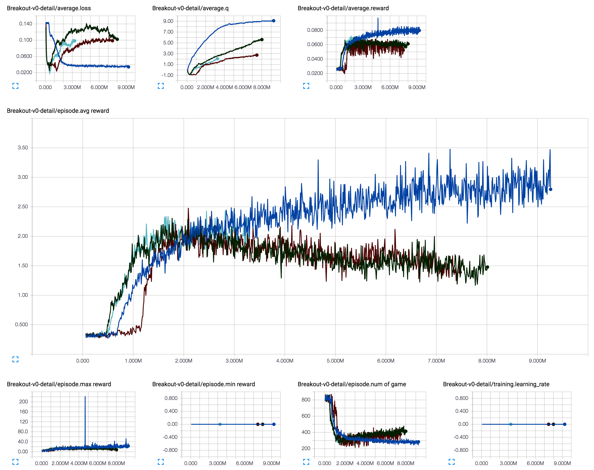

## Results

### [1] Action-repeat (frame-skip) of 1, 2, and 4 without learning rate decay

### [2] Action-repeat (frame-skip) of 1, 2, and 4 with learning rate decay

### [1] & [2]

### [3] Distributed Action-repeat (frame-skip) of 4 without learning rate decay

### [4] DQN (dark blue) Dueling DQN (dark green) DDQN (brown) Dueling DDQN (turquoise)

The current hyper parameters and gradient clipping are not implemented as it is in the paper.

